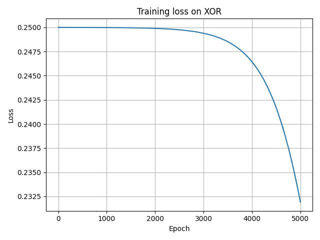
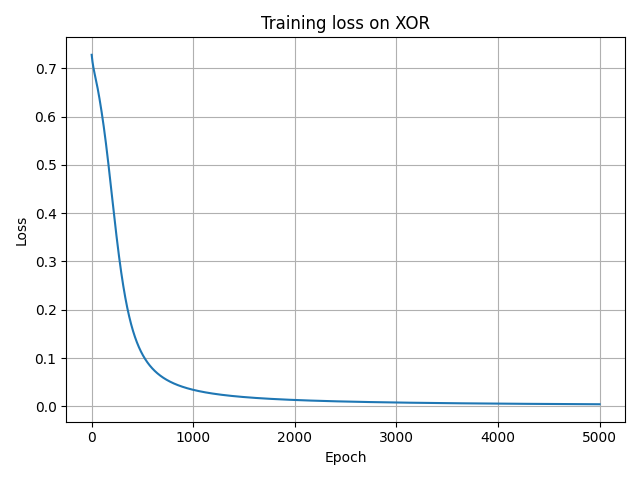

# Tiny Neural Network from Scratch (NumPy)

[](https://github.com/Arthur7Li/tiny-nn-xor/actions/workflows/ci.yml)
[](LICENSE)
[](pyproject.toml)

Implementing a tiny neural network **from scratch in NumPy** to solve the classic XOR problem, then extending it to nonlinear 2D toy datasets.
This project is designed as an educational intro to:

- How a 2-layer neural network performs a **forward pass**
- How **backpropagation** computes gradients for each parameter
- How a simple **training loop** with gradient descent can learn a nonlinear function
- How to verify those gradients are actually correct with numerical **gradient checking**
- How to visualize what the network learned via its **decision boundary**

No deep learning frameworks (PyTorch, TensorFlow, Keras, scikit-learn) are used—only NumPy and Matplotlib.

---

## Project structure

```text
.
├── nn_numpy/
│   ├── __init__.py       # Public API: NeuralNetwork, Dense, load_xor, load_circles, load_moons, plot_decision_boundary
│   ├── activations.py    # sigmoid, tanh, ReLU and their derivatives
│   ├── datasets.py       # XOR, circles, and moons dataset helpers
│   ├── layers.py         # Dense layer (fully connected) with forward/backward
│   ├── losses.py         # Binary cross-entropy loss + derivative
│   ├── model.py          # NeuralNetwork class and training loop
│   └── visualize.py      # Decision-boundary plotting
├── tests/                # pytest suite: gradient checks + sanity checks (22 tests)
├── train_xor.py          # Entry point: trains on XOR, saves loss curve + decision boundary
├── train_toy.py          # Entry point: trains on circles/moons, saves loss curve + decision boundary
├── pyproject.toml        # Packaging (pip install -e .) + pytest/ruff config
├── requirements.txt
├── .github/workflows/ci.yml  # Runs the test suite on Python 3.10–3.12 on every push/PR
└── README.md
```

---

## Getting started

### 1. Clone the repo

```bash
git clone https://github.com/Arthur7Li/tiny-nn-xor.git
cd tiny-nn-xor
```

### 2. Create and activate a virtual environment

```bash
python -m venv .venv
# PowerShell
.\.venv\Scripts\Activate
# or cmd
.\.venv\Scripts\activate.bat
```

### 3. Install dependencies

Either install just the runtime dependencies:

```bash
pip install -r requirements.txt
```

Or install the package itself (recommended—this also gives you `import nn_numpy` from anywhere and pulls in test/lint tools):

```bash
pip install -e ".[dev]"
```

### 4. Train on XOR

```bash
python train_xor.py
```

This prints the training loss every 100 epochs, reports final accuracy (100% for the current model), and saves `train_run.png` (loss curve) and `decision_boundary_xor.png` (decision boundary) to the current directory. Useful flags:

```bash
python train_xor.py --hidden-dim 8 --epochs 5000 --learning-rate 0.1 --seed 42 --output-dir artifacts
```

Run `python train_xor.py --help` for the full list of options.

### 5. Train on a nonlinear 2D toy dataset

```bash
python train_toy.py --dataset moons
python train_toy.py --dataset circles
```

Since XOR only has 4 points, `train_toy.py` trains the same `NeuralNetwork` on 200-point circles/moons datasets (generated with pure NumPy, no scikit-learn) and plots the resulting decision boundary—a much more visually convincing demonstration that the network learns genuinely nonlinear separators.

### 6. Run the test suite

```bash
pytest -v
```

22 tests cover numerical gradient checks for every activation, the loss function, the `Dense` layer, and the full network end-to-end, plus dataset and visualization sanity checks. CI runs this suite automatically on Python 3.10, 3.11, and 3.12 for every push and pull request.

---

## How it works

### Architecture

For XOR, the network uses a simple **2-layer MLP**:

- Input layer: 2 features (the two XOR bits)  
- Hidden layer: `hidden_dim` units (e.g., 4 in v0.1, 8 in v0.2)  
  - Activation: **tanh** in the final version (ReLU in the initial version)  
- Output layer: 1 unit  
  - Activation: **sigmoid**, interpreted as a probability in \([0, 1]\)

The same architecture is reused unchanged for the circles/moons datasets—only the hidden width and learning rate are tuned via CLI flags.

Mathematically:

- Hidden pre-activation:  
  \[
  z_1 = X W_1 + b_1
  \]
- Hidden activation:  
  \[
  a_1 = \tanh(z_1) \quad \text{(or ReLU in v0.1)}
  \]
- Output pre-activation:  
  \[
  z_2 = a_1 W_2 + b_2
  \]
- Output activation (prediction):  
  \[
  \hat{y} = \sigma(z_2)
  \]

### Forward and backward passes

- **Forward pass**: `NeuralNetwork.forward(X)` computes these steps and caches intermediate values (`z1`, `a1`, `z2`, `a2`) for backprop.  
- **Loss**: binary cross-entropy (BCE), appropriate for the sigmoid output.
- **Backward pass**: `NeuralNetwork.backward(y_true)`:
  - Starts from the derivative of the loss with respect to the output (`dL/dy_pred`)
  - Applies the derivative of the sigmoid and tanh to propagate gradients back to `W2`, `b2`, `W1`, and `b1`
  - Uses the `Dense.backward` method to compute gradients and apply gradient descent updates

All operations are implemented with NumPy array math; no automatic differentiation is used. Every gradient in this repo is checked against finite differences in `tests/` rather than assumed correct.

---

## Versions and progress

A key goal of this project is to show the **iterative improvement** of a simple neural network:

### v0.1 – First working model (75% accuracy)

- Architecture: Input → **4 ReLU** hidden units → 1 sigmoid output  
- Loss: **MSE (mean squared error)**  
- Result: Final training accuracy **75%** on XOR (3/4 points correct); loss decreases slowly, plotted in `train_1.png`

### v0.2 – Improved model (100% accuracy)

- Switched hidden activation to **tanh**, loss to **binary cross-entropy**, and initialization to **Xavier-style**
- Added runtime shape assertions in `Dense` and `NeuralNetwork`
- Result: Final training accuracy **100%** on XOR (4/4 points correct), plotted in `train_final.png`

### v0.3 – Portfolio refinement (reproducibility, visualization, packaging, CI)

- **Reproducible training**: `train_xor.py` now has a full CLI (`--hidden-dim`, `--epochs`, `--learning-rate`, `--seed`, etc.) and saves its plots via `plt.savefig()` instead of only `plt.show()`, so every plot in this repo can be regenerated exactly from the tracked code.
- **Decision-boundary visualization**: `nn_numpy/visualize.py` renders the model's learned decision boundary over a 2D grid, for both XOR and the new toy datasets.
- **New toy datasets**: `nn_numpy/datasets.py` gained `load_circles()` and `load_moons()` (pure NumPy, no scikit-learn), trainable via the new `train_toy.py` entry point.
- **Test suite**: 22 pytest tests, including numerical gradient checks for every activation, the loss function, the `Dense` layer, and the full network—not just accuracy checks.
- **Packaging + public API**: `pyproject.toml` makes the project `pip install`-able; `nn_numpy/__init__.py` now exposes a clean public API (`NeuralNetwork`, `Dense`, `load_xor`, `load_circles`, `load_moons`, `plot_decision_boundary`).
- **CI**: GitHub Actions runs the full test suite on Python 3.10–3.12 on every push and pull request.

---

## Training curves

- **v0.1 – 75% accuracy (ReLU + MSE)**  
  

- **v0.2 – 100% accuracy (tanh + BCE)**  
  

Run `python train_xor.py` or `python train_toy.py --dataset moons` to regenerate up-to-date loss-curve and decision-boundary plots for the current model.

---

## Datasets

`nn_numpy/datasets.py` provides three toy datasets, all pure NumPy with no external dependency:

- **XOR** (`load_xor`): the classic 4-point, linearly-inseparable dataset this project was originally built around.

  \[
  X = \{(0,0), (0,1), (1,0), (1,1)\}, \quad y = \{0, 1, 1, 0\}
  \]

- **Circles** (`load_circles`): two concentric circles, a standard test for nonlinear classifiers.
- **Moons** (`load_moons`): two interleaving half-moons.

Both `load_circles` and `load_moons` accept `n_samples`, `noise`, and `seed`, and use an independent `np.random.default_rng` so generating data doesn't disturb the global NumPy random state used for weight initialization.

---

## Implemented extensions

Earlier drafts of this README listed these as ideas for future work. They're now implemented:

- [x] Visualize the decision boundary in the input space on a grid (`nn_numpy/visualize.py`)
- [x] Swap XOR for a slightly larger 2D toy dataset (circles, moons via `train_toy.py`)
- [x] Add lightweight unit tests for `Dense`, activations, and loss functions (`tests/`, with numerical gradient checks)
- [x] Make training runs reproducible and configurable via CLI flags
- [x] Package the project and add CI

Remaining ideas for further extension:

- Add support for more layers (deep MLP) or additional activation functions
- Implement simple **regularization** (L2 weight decay)
- Promote the `ruff` lint job in CI from informational to blocking once the codebase has been reviewed against it once

---

## Acknowledgements

This project was developed as a learning exercise with the help of AI tools, used as assistants rather than as autopilot:

- **Perplexity's Learn Mode AI tutor**, for step-by-step guidance on neural network concepts, project structure, and implementation details in the original v0.1/v0.2 versions.
- **GitHub Copilot**, for in-editor suggestions and refinements, including improvements to gradient scaling, weight initialization, and runtime assertions.
- **Perplexity**, for the v0.3 portfolio-refinement pass: reviewing the repository for issues, and implementing the reproducibility fixes, decision-boundary visualization, toy datasets, test suite, packaging, and CI described above—verified locally (tests run, plots regenerated, package installed) before every change was pushed.

Across all versions, the underlying math, architecture decisions, and final code were reviewed and understood by the author rather than accepted blindly.
